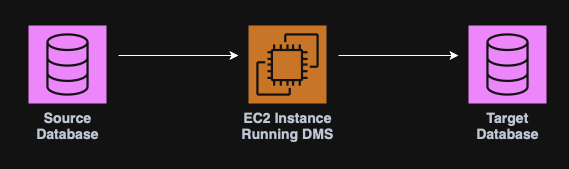

**Table of contents:**

- [06. Databases](#06-databases)
  - [SQL Databases](#sql-databases)
    - [Amazon RDS](#amazon-rds)
      - [RDS Replication](#rds-replication)
    - [Amazon Aurora (Serverless)](#amazon-aurora-serverless)
  - [No SQL Databases](#no-sql-databases)
    - [DynamoDB (Serverless)](#dynamodb-serverless)
      - [DynamoDB Accelerator (DAX)](#dynamodb-accelerator-dax)
    - [DocumentDB (Serverless)](#documentdb-serverless)
    - [Amazon Neptune](#amazon-neptune)
  - [DMS - Database Migration Service](#dms---database-migration-service)
  - [Amazon Quicksight](#amazon-quicksight)
  - [Amazon ElastiCache](#amazon-elasticache)
  - [Amazon Redshift](#amazon-redshift)
  - [Amazon EMR](#amazon-emr)

# 06. Databases

AWS provides multiple types of databases that can be split in to:

- [SQL Databases](#SQL%20Databases) (Serverless & Non-Serverless);
- [No SQL Databases](#No%20SQL%20Databases) (Serverless & Non-Serverless);

## SQL Databases

### Amazon RDS

RDS is a **managed service for relational databases** that supports standard SQL queries and automates provisioning, backups, patching and scaling.

RDS supports PostgreSQL,, MySQL, MariaDB, Oracle and Aurora (AWS proprietary).

**Note:** There is no SSH access to RDS instances.

#### RDS Replication

Replication is used to scale read traffic by creating read replicas of the primary DB.

It is possible to create up to 15 asynchronous read replicas, however, **only the primary DB accepts writes**.

  

### Amazon Aurora (Serverless)

Aurora is a fully managed, MySQL & PostgreSQL compatible relational database engine designed for the cloud, combining high performance and availability.

Key points:

- Offers up to 5x the performance of a standard MySQL and 3x of PostgreSQL;
- Storage automatically scales from 10 GB to 128 TB;
- Costs more that [RDS](#Amazon%20RDS) (~20%);
- Provides automated backups, snapshots and replication;

## No SQL Databases

### DynamoDB (Serverless)

DynamoDB is a fully managed, NoSQL database that offers single-digit millisecond latency and scales automatically.

Key points:

- Key-value & document data models;
- Supports millions of requests per second;
- Ideal for real time applications, IoT, gaming and mobile apps;

  

#### DynamoDB Accelerator (DAX)

DAX is a fully managed **in-memory cache** for DynamoDB that improves read performance by up to 10x.

**Note:** DAX is only for DynamoDB.

### DocumentDB (Serverless)

DocumentDB is a fully managed MongoDB compatible database engine designed for the cloud, combining high performance and availability.
### Amazon Neptune

Neptune is a fully managed **graph database** for storing complex relationships and querying them with high performance.

Use cases: Social networks, recommendation engines, fraud detection.

  

**Note:** Supports property graph (Gremlin) & RDF (SPARQL) models.

## DMS - Database Migration Service

The AWS Database Migration Service helps migrate databases to AWS quickly and securely.

  

Key points:

- Supports homogeneous migrations, (e.g. Oracle to Oracle);
- Supports heterogeneous migrations (e.g. Microsoft SQL Server to Amazon Aurora);
- Minimal downtime during migration;
- Can migrate data continuously.

## Amazon Quicksight

Amazon Quicksight is a serverless machine learning-powered business intelligence service to create interactive dashboards.

## Amazon ElastiCache

Amazon ElastiCache is a fully managed service that allows you to deploy, operate, and scale **in-memory data stores** like **Redis** and **Memcached**.

It is specifically designed for **high performance and low latency**.

Use cases: Caching, real-time analytics, session stores and leaderboards.

## Amazon Redshift

Amazon Redshift is designed for **analytics and reporting** on large volumes of structured and semi-structured data.

Redshift stores data **columnar** (column-oriented), which is optimized for **aggregations and analytical queries** rather than transactional workloads.

## Amazon EMR

Amazon EMR is a **managed big data processing service**. It allows the processing and analyzys on massive amounts of data using frameworks like Apache **Hadoop**, Spark, HBase, Flink, and Presto.

EMR takes care of provisioning and configuring multiple [EC2](04.%20Amazon%20EC2.md#04.%20EC2) instances in a cluster so that they can work together in analyzing data from a big data perspective.

Use cases: Data processing, machine learning, web indexing, big data, etc.