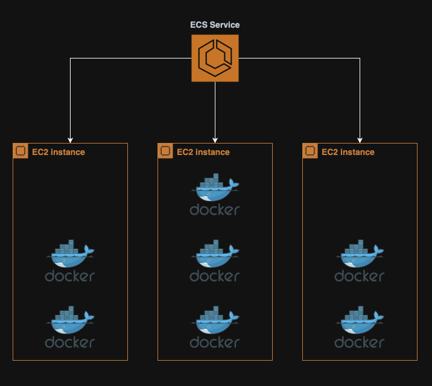
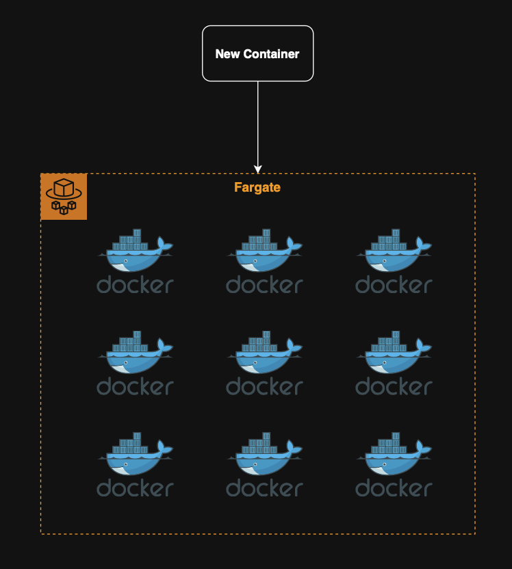

**Table of contents:**

- [07. Compute Services](#07-compute-services)
  - [Container Services](#container-services)
    - [Amazon ECS (Elastic Container Service)](#amazon-ecs-elastic-container-service)
    - [AWS Fargate (Serverless)](#aws-fargate-serverless)
    - [Amazon ECR (Elastic Container Registry)](#amazon-ecr-elastic-container-registry)
    - [Amazon EKS (Elastic Kubernetes Service)](#amazon-eks-elastic-kubernetes-service)
  - [Lambda Functions (Serverless)](#lambda-functions-serverless)
  - [AWS Batch](#aws-batch)

# 07. Compute Services

## Container Services

### Amazon ECS (Elastic Container Service)

Amazon ECS is a fully managed **container orchestration service** for running Docker containers in AWS.

**Note:** While ECS handles placement, scaling and scheduling of containers, these will run on user-managed [EC2](04.%20Amazon%20EC2.md#04.%20EC2) instances.

  

### AWS Fargate (Serverless)

AWS Fargate is a c**ompute engine for containers** that works with [ECS](#Amazon%20ECS%20(Elastic%20Container%20Service)) and [EKS](#Amazon%20EKS%20(Elastic%20Kubernetes%20Service)).

  

**Note:** There is no need to manage [EC2](04.%20Amazon%20EC2.md#04.%20EC2) instances when using Fargate.

### Amazon ECR (Elastic Container Registry)

Amazon ECR is a fully managed, **private Docker image repository** for storing and managing container images.

It is integrated with [ECS](#amazon-ecs-elastic-container-service) and [Fargate](#AWS%20Fargate%20(Serverless)).

  

**Note:** Supports lifecycle policies and [IAM](03.%20IAM.md#03.%20IAM)-based access control.

### Amazon EKS (Elastic Kubernetes Service)

Amazon EKS is a **managed [Kubernetes](01.%20Overview.md#01.%20Overview) control plane** for running containerized applications using Kubernetes.

It supports standard `kubectl`commands and AWS managed the k8s control plane, while the user managed the worker nodes (via [EC2](04.%20Amazon%20EC2.md#04.%20EC2) or [Fargate](#AWS%20Fargate%20(Serverless))).

  

## Lambda Functions (Serverless)

Lambda is a service to run **event driven functions** without provisioning or managing servers.

Key points:

- Automatically scales with demand;
- Pay-per-request and duration billing;
- Supports triggers from [S3](05.%20Amazon%20S3.md), [Amazon API Gateway](08.%20Integration%20Services.md#Amazon%20API%20Gateway%20(Serverless)), [EventBridge](11.%20Cloud%20Monitoring.md#EventBridge%20(Serverless)) and more;
- Ideal for short-lived tasks (e.g. Image processing, data transformation).

  

## AWS Batch

AWS Batch is a fully managed service to **run batch computing jobs** efficiently at any scale.

Key points:

- Automatically provisions compute ([EC2](04.%20Amazon%20EC2.md#04.%20EC2));
- Jobs are defined using Docker images;
- Runs on [ECS](#Amazon%20ECS%20(Elastic%20Container%20Service)) in the background;
- Ideal for analytics, simulations or large scale data processing.