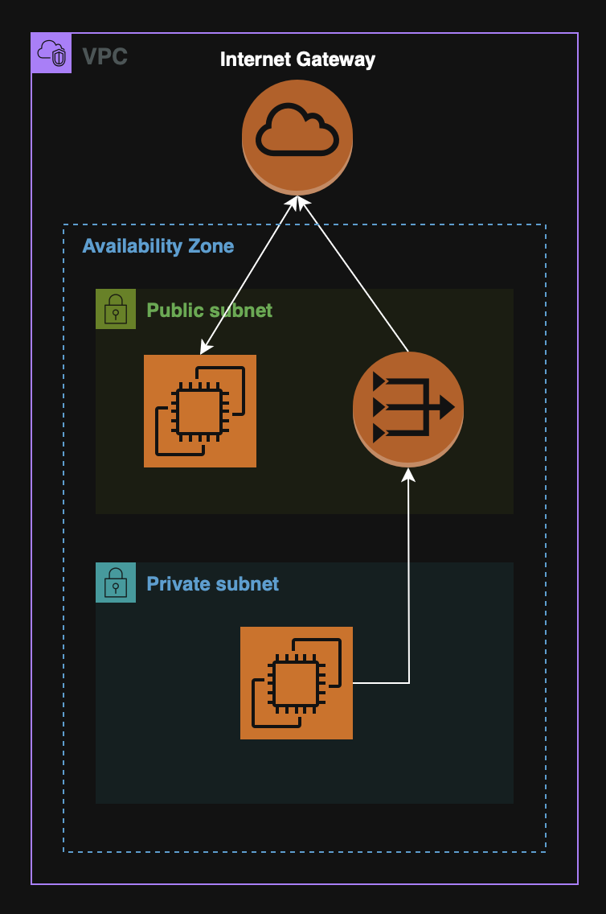

**Table of contents:**

- [09. VPCs \& Networking](#09-vpcs--networking)
  - [IP Addresses](#ip-addresses)
    - [IPv4](#ipv4)
      - [Public IPv4](#public-ipv4)
      - [Private IPv4](#private-ipv4)
      - [Elastic IP](#elastic-ip)
    - [IPv6](#ipv6)
  - [VPCs \& Subnets](#vpcs--subnets)
    - [VPC Flow Logs](#vpc-flow-logs)
    - [VPC Peering](#vpc-peering)
    - [VPC Endpoints](#vpc-endpoints)
      - [Gateway Endpoint](#gateway-endpoint)
      - [Interface Endpoint](#interface-endpoint)
  - [PrivateLink](#privatelink)
  - [Site-to-Site VPN \& Direct Connect](#site-to-site-vpn--direct-connect)
    - [Site-to-Site VPN](#site-to-site-vpn)
    - [Direct Connect (DX)](#direct-connect-dx)
  - [AWS Client VPN](#aws-client-vpn)
  - [Transit Gateway (TGW)](#transit-gateway-tgw)
  - [NACL \& Security Groups](#nacl--security-groups)
    - [NACL (Network ACL)](#nacl-network-acl)
    - [Security Groups](#security-groups)

# 09. VPCs & Networking

## IP Addresses

### IPv4

IPv4 is the standard **32-bit** address system to identify resources on a network.

**Note:** All public IPv4 addresses (incl. Elastic IPs) are $0.005/hr.

#### Public IPv4

Used to access resources via the internet.

**Note:** [EC2](04.%20Amazon%20EC2.md#04--ec2) instances get a new public IPv4 address on stop/start.

#### Private IPv4

Used within VPCs for internal communication

**Note:** Remains the same after instance restart.

#### Elastic IP

Fixed public IPv4 attached to an [EC2](04.%20Amazon%20EC2.md#04--ec2).

Useful for stable endpoints (e.g. VPNs).

### IPv6

IPv6 is a **128-bit** addressing system where **all addresses are public**.

**Note:** IPv6 is free to use in AWS.

## VPCs & Subnets

A Virtual Private Network, (VPC), is an isolated AWS network where it is possible to deploy resources.

A subnet is a range if IPs inside a VPC, associated with a specific [AZ](02.%20AWS%20Global%20Infrastructure.md#availability-zones-azs).

- **Public Subnet:** - Has route to internet Gateway;
- **Private Subnet** - No direct internet access. Needs NAT (Gateway or Instance).

  

### VPC Flow Logs

VPC Flow Logs **capture network traffic logs** from VPC components.

**Note:** Can monitor traffic at different levels, (VPC, Subnet, ENI).

Use cases: Troubleshooting, auditing and monitoring.

### VPC Peering

VPC Peering is **used to connect two VPCs** privately over AWS's network.

Key points:

- No CIDR overlapping is allowed;
- Can connecct VPCs from different regions;
- Not transitive. (VPC A <-> VPC B and VPC B <-> VPC C, does not mean that VPC A <-> VPC C).

  

### VPC Endpoints

A VPC Endpoint provides **private access** to AWS services **without using the internet**.

VPC Endpoints improve security & latency and eliminate the need for Internet Gateways or NAT.

  

There are two types of VPC Endpoints:

#### Gateway Endpoint

Used **only** by [S3](05.%20Amazon%20S3.md) and [DynamoDB](06.%20Databases.md#dynamodb-serverless).

#### Interface Endpoint

Used by all other services.

## PrivateLink

PrivateLink is used to **privately expose services** hosted in one **VPC to another VPC**.

This is a more scalable and secure option that VPC Peering and great for [SaaS](00.%20Cloud%20Concepts.md#software-as-a-service-saas) applications or internal micro-services.

  

## Site-to-Site VPN & Direct Connect

  

### Site-to-Site VPN

Site-to-Site VPN is an **encrypted connection** between an on-prem Data Center and an AWS VPC **over the public internet**.

It required a Customer Gateway (on-prem) and a Virtual Private Gateway (AWS).

**Note:** May raise some latency and security considerations despite encryption.

### Direct Connect (DX)

Direct Connect is a private, **dedicated physical** connection between on-prem and AWS

**Note:** DX bypasses the public internet, (faster & more secure), however, it takes ~1 month to provision.

## AWS Client VPN

The AWS Client VPN securely **connects user devices**, (laptops, etc.) **to a VPC**.

It works **over the public internet** and scales up to thousands of users.

## Transit Gateway (TGW)

A Transit Gateway is a centralized hub used to **connect multiple VPCs and VPNs**.

Key points:

- Scales better that point-to-point peering;
- Non-transitive peering replaced by a single TGW route table;
- Does not use the public internet for routing.

  

## NACL & Security Groups

### NACL (Network ACL)

NACL is a **stateless firewall** at the **subnet level**.

It allows for ALLOW and DENY IP based rules that are evaluated in order.

### Security Groups

A Security Group is a **stateful firewall** attached to an [EC2](04.%20Amazon%20EC2.md#04--ec2) or ENIs, (Elastic Network Interfaces).

It is applied at the instance level and only ALLOW rules can be defined.