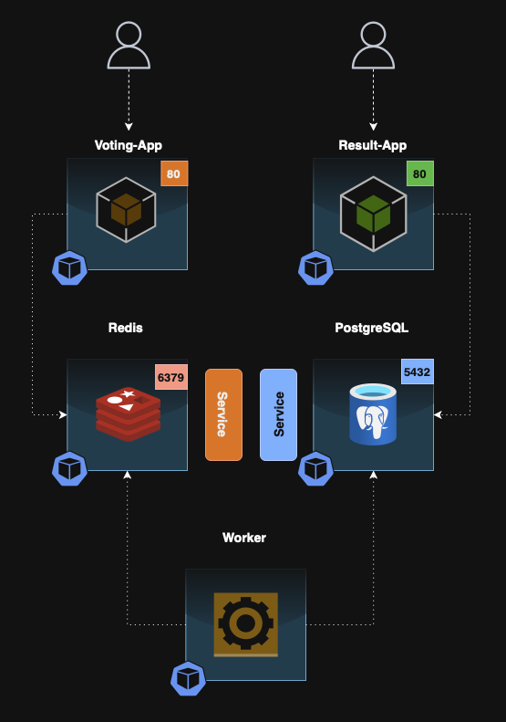

# Voting App

This repository contains a Kubernetes mini project that provisions a simple, micro-services oriented application architecture that provides two user interfaces.

One where the users can vote and another where they can see the results.

<div align="center">
    
</div>

**Note:** This scenario was taken from KodeKloud's "Kubernetes for the Absolute Beginners" course series.

## Architecture breakdown

The **Voting-App** is an application developed in Python that provides an interface where the user can vote in either a cat or a dog.

When a selection is made, the vote is stored on **Redis** that serves as an in-memory database.

The vote is then processed by the **worker** which is an application written in .NET.

The worker will then proceed to update the persistent database which is a **PostgreSQL** database with a single table and two columns, (Cats & Dogs), that keeps track of the number of votes.

Finally, the result of the vote is displayed on the **Result-App**, an application written in NodeJS.

## Deployment breakdown

Included in this repository are the object manifests for the deployments and services required to run the application.

You can deploy this in your cluster by running:

```bash
https://github.com/Patricio-Simoes/DevOps.git
cd DevOps/Kubernetes/Projects/Voting-App/Manifests
kubectl apply -f ./Deployments
kubectl apply -f ./Services
```

After applying, you will be able to reach the application in your browser by going to:
- ${NODE_IP}:30000
- ${NODE_IP}:30001

**Note:** You can get your NODE_IP by running:

```bash
kubectl get nodes
```

## End Result

**Voting UI:**

<div align="center">
    
</div>

**Results UI:**

<div align="center">
    
</div>